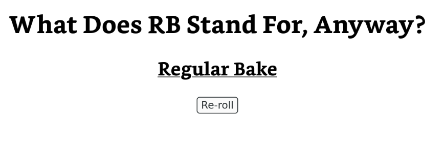

# What Does That Stand For, Anyway?

Find the[^1] meaning of that acronym you've always been curious about!

Inspired by [@ReluctusB's](https://github.com/ReluctusB)
[WDRBSFA](https://reluctusb.github.io/WDRBSFA/) site.

[^1]: Almost certainly incorrect unless you get *very* lucky.

## Usage

The acronym to define is specified with the `a` query parameter.

It will replace "That" in the heading text with the acronym being defined and
show a meaning below that.

To disable the preset word lists, use the query parameter `preset` with a value
of `false`.

To add word lists, use the query parameter `w` with the url as the value.
This parameter can be used multiple times.

## Build

This project uses [shadow-cljs](https://github.com/thheller/shadow-cljs) to
compile [ClojureScript](https://clojurescript.org/) to javascript.
You'll need a java sdk and node.js installed.

To compile, run `npx shadow-cljs release frontend`.

The compiled output will be in `public/js`.

## Run

Use some http server to serve the `public` directory.

As an example, to serve with python's built in http server on port 8080, run
`python -m http.server 8080`.
